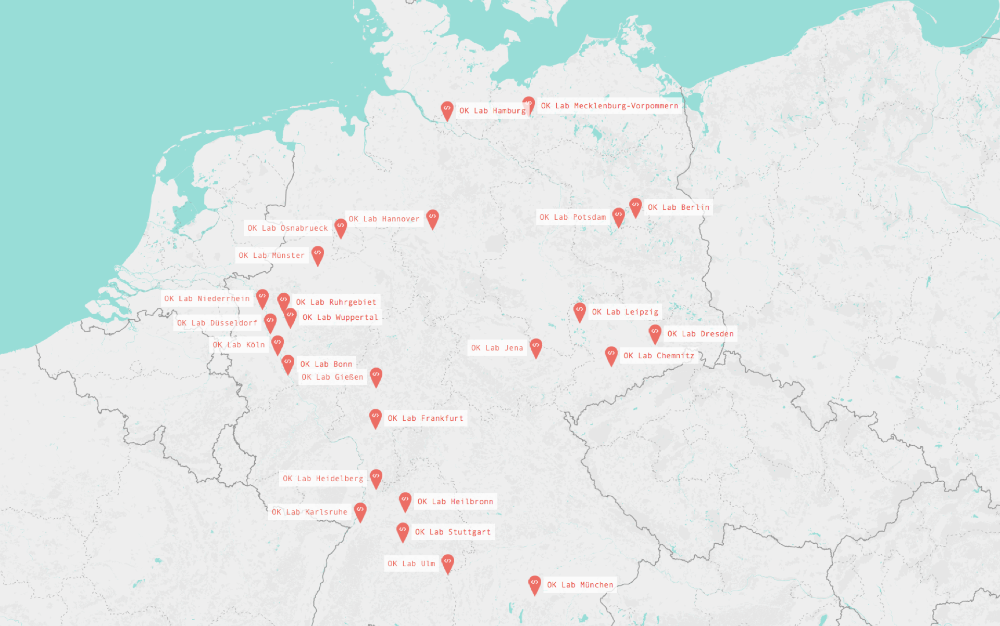
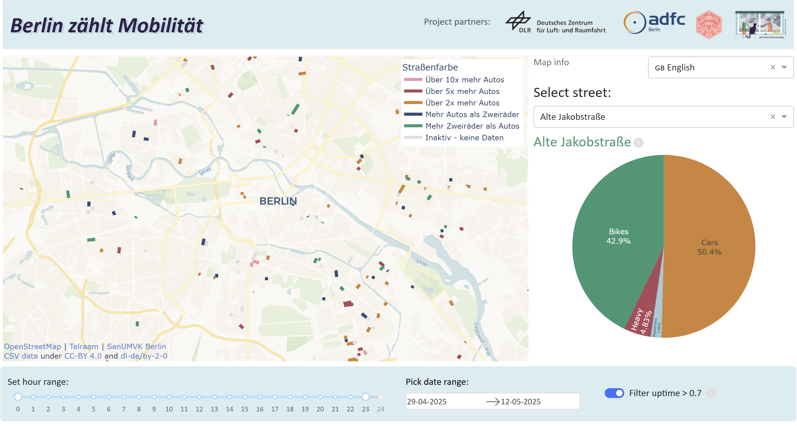
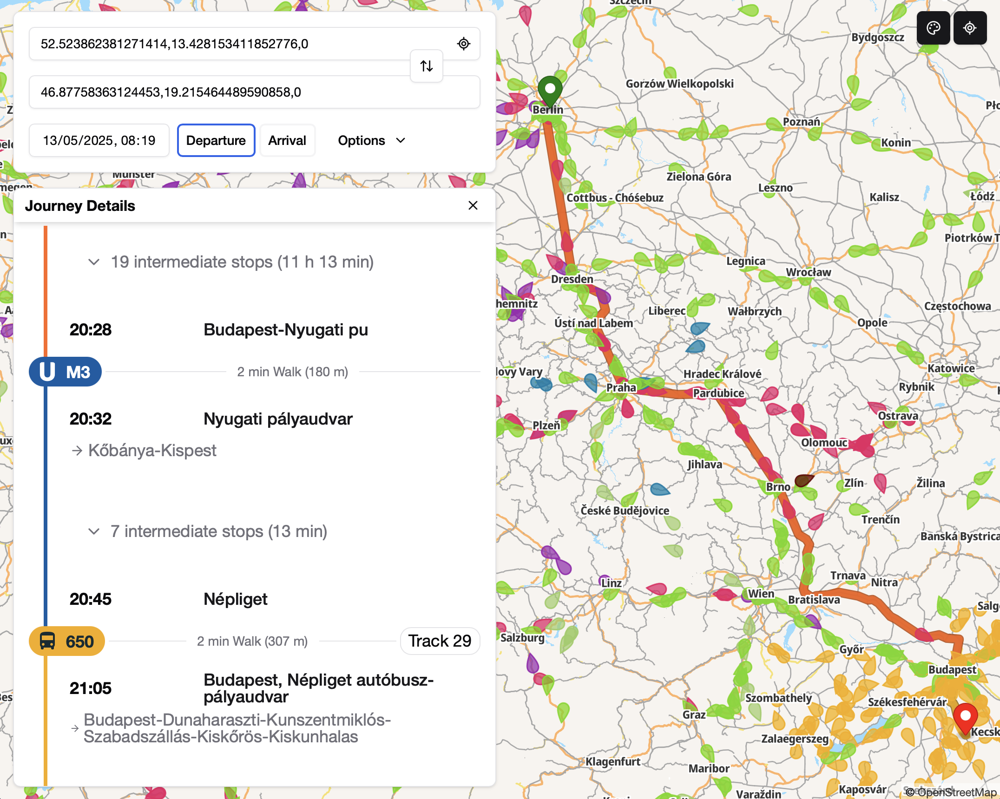
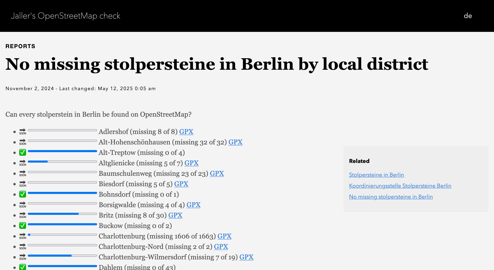
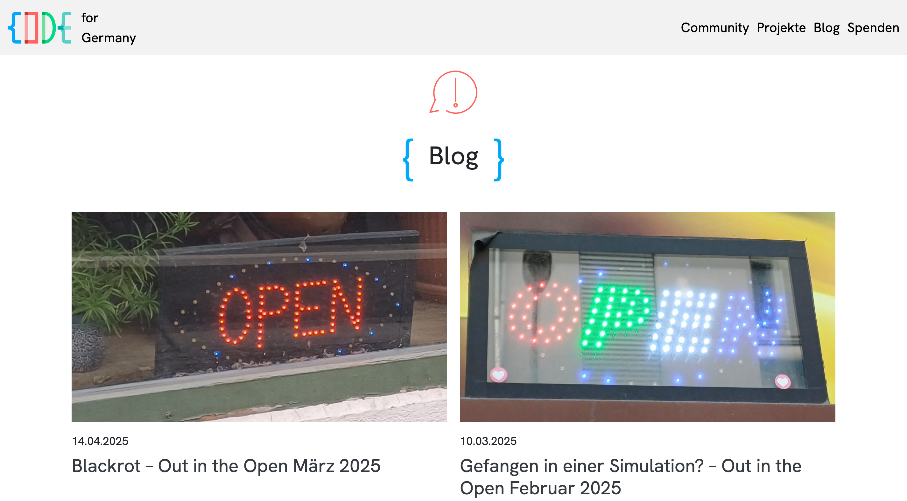

class: middle, center

## Open Lab

.list[
* we start at 20:00
]

---

class: middle, center

## Open Lab

.list[
* we start in a few minutes
]

---

class: center, middle

.vspace[]

## Introduction

---

## Code for Germany

.abs.open[]

.column.oklab[
We identify .blue.b[human needs] in the digital world and scrutinize technological developments for their .red.b[benefit to society].

With our volunteer network, we develop .green.b[open source software] and .cyan.b[liberate data]!

We want to shape the .blue.b[open and sustainable digital transformation] from within society - for a world in which the possibilities of digitization benefit .red.b[everyone].
]

---

## Who are we?

Code for Germany connects people with .blue.b[similar interests] who are committed to .red.b[Free and Open Software], .green.b[Open Data] and .cyan.b[Open Government].

We are .blue.b[open government experts], .red.b[software developers], .green.b[designers], and other activists, who work as volunteers for a .cyan.b[sustainable digital transformation in politics and administration].

We are organized .blue.b[local OK Labs] in Germany and aim to connect .red.b[the community] with the .green.b[local government] and act as contact for the .cyan.b[different stakeholders].

---

.center.screen.shadow[

]

.ref[
[codefor.de/community](https://codefor.de/community/)
]

---

## Open Knowledge Lab Berlin

.abs.wurst[]

* Open Lab every 2nd Monday of the month
* 18:00-22:00
* [WikiBär](https://de.wikipedia.org/wiki/Wikipedia:WikiB%C3%A4r), Köpenicker Straße 45
* [codefor.de/berlin](https://codefor.de/berlin)  
* [@codeforde@chaos.social](https://https://chaos.social/@codeforbe)  
* [github.com/codeforberlin](https://github.com/codeforberlin) 
* [meetup.com](https://www.meetup.com/OK-Lab-Berlin/), 
  [gettogether.community](https://gettogether.community/code-for-berlin/)

.slack[
      
    [openknowledgegermany.slack.com](https://openknowledgegermany.slack.com)  
]

---

.center.shadow.screen[

]

.ref[
[Daten aus dem Geoportal Berlin](https://codefor.de/projekte/fis-broker/)
]

---

.center.shadow.screen[

]

.ref[
[jedeschule.de API](https://codefor.de/projekte/jedeschule-2/)
]

---

.center.shadow.screen[

]

.ref[
[Berlin zählt Mobilität](https://berlin.adfc.de/artikel/berlin-zaehlt-mobilitaet-adfc-berlin-dlr-rufen-zu-citizen-science-projekt-auf-1/)
]

---

.center.shadow.screen[

]

.ref[
[Transitous](https://transitous.org/)
]

---

.center.shadow.screen[

]

.ref[
[No missing stolpersteine](https://osm-check.chrpaul.de/report/stolpersteine-berlin-complete-by-kiez/)
]

---

Out in the Open
---------------

.center.shadow.w75[

]

.ref[
[codefor.de/blog](https://codefor.de/blog/)
]

---

## Support

.abs.okf[
      
    [Open Knowledge Foundation](https://okfn.de)
]

.abs.wikimedia[
      
    [Wikimedia Deutschland](https://www.wikimedia.de)
]

---

class: center, middle

