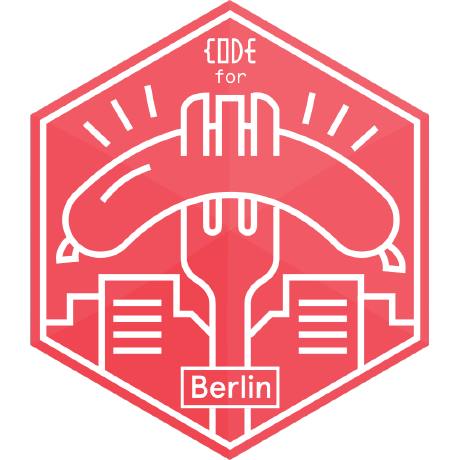
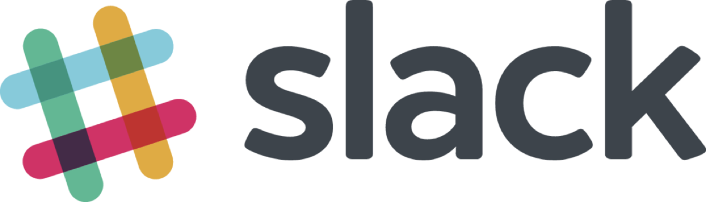

class: center, middle

.vspace[]

# Open Knowledge Lab Berlin

## Introduction

---

## Open Knowledge Lab Berlin

.fig.open[]

.column.oklab[
In the OK Lab, we work on **digital tools**  utilizing Open Data from **public entities**, **community projects**, and **companies**.

We also **connect** the community with the local government and act as contact for the different stakeholders.

We use **different formats** to reach people and educate them about Open Data and Civic Tech.
]

---

## Open Knowledge Lab Berlin

.fig.wurst[]

#### Hacknights

* Monday, 19:00-22:00
* ~~WikiBär, Köpenicker Straße 45~~

#### Open Lab

* every second Monday of the month
* ~~Wikimedia, Tempelhofer Ufer 23/24~~

#### Open data day

* once a year, first Saturday in March

---

background-image: url(img/berlin-map.png)

.ref[
    [© OpenStreetMap contributors](https://www.openstreetmap.org/copyright)
]

---

## What are we working on

List of older projects: [codefor.de/berlin](https://codefor.de/berlin)

Some Highlights:

* [Wo ist Markt?](https://codefor.de/projekte/be-woistmarkt/)
* [Street Trees API](https://codefor.de/projekte/be-street-trees-api/)
* [VBB-API](https://codefor.de/projekte/vbb-api/)

We are currently immersing ourselves in the **semantic web** and trying to make already public data sets available in a **best practice** way.

---

## Communication

.communication[]

[openknowledgegermany.slack.com](https://openknowledgegermany.slack.com) (ask us for an invite)

.communication[ ]

[github.com/codeforberlin](https://github.com/codeforberlin)

---

background-image: url(img/germany-map.png)
background-size: cover

## Code for Germany

.ref[
    [codefor.de](https://codefor.de)
]

---

## Code for all

.fig.codeforall[]

.ref[
    [codeforall.org](https://codeforall.org)
]

---

## Thanks!

.fig.okf[
      
    [Open Knowledge Foundation](https://okfn.de)
]

.fig.wikimedia[
      
    [Wikimedia Deutschland](https://www.wikimedia.de)
]
