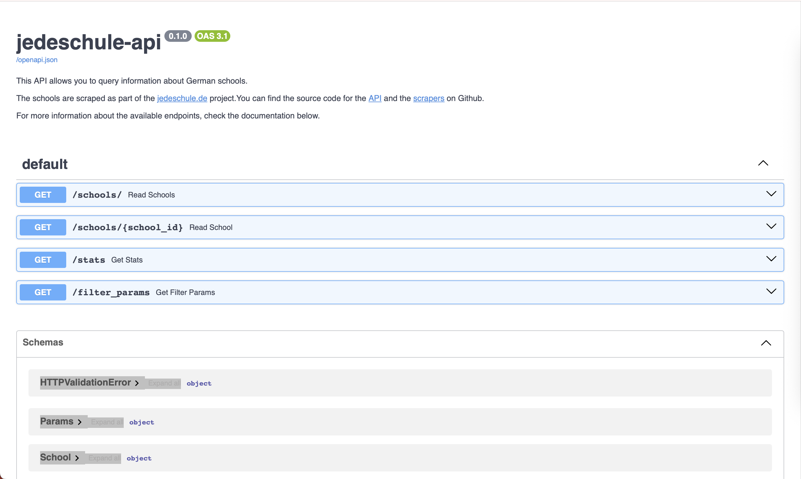

class: middle, center, nonumber

## Welcome to the Berlin Open Knowledge Lab

.list[
* we start at 19:00
]

---

class: middle, center, nonumber

## Welcome to the Berlin Open Knowledge Lab

.list[
* we start in a few minutes
]

---

class: center, middle, nonumber

.vspace[]

# Open Knowledge Lab Berlin

## Introduction

---

## Open Knowledge Lab Berlin

.abs.open[]

.column.oklab[
In the OK Lab, we work on .red.b[digital tools] utilizing Open Data from .blue.b[public entities], .green.b[community projects], and .cyan.b[companies].

We also .red.b[connect] the community with the local government and act as contact for the different stakeholders.

We use different formats to .red.b[reach people] and educate them about Open Data and Civic Tech.
]

---

## Open Knowledge Lab Berlin

.abs.wurst[]

#### Hacknights

* Monday, 19:00-22:00
* WikiBär, Köpenicker Straße 45

#### Open Lab

* every second Monday of the month
* [bbb.ulm.dev/b/ok-lab-berlin](https://bbb.ulm.dev/b/ok-lab-berlin)

#### Berlin Open Data Day

* once a year, first Saturday in March

---

## Open Knowledge Lab Berlin

.abs.wurst[]

#### Hacknights

* Monday, 19:00-20:00
* [meet.okfn.de/ok-lab-berlin](https://meet.okfn.de/ok-lab-berlin)

#### Open Lab

* every second Monday of the month
* [bbb.ulm.dev/b/ok-lab-berlin](https://bbb.ulm.dev/b/ok-lab-berlin)

#### ~~Berlin~~ Open Data Day

* https://opendataday.org/de/

.ref[
    Photo by <a href="https://unsplash.com/@cdc">CDC</a> on <a href="https://unsplash.com/s/photos/corona">Unsplash</a>
]

---

exclude: true

background-image: url(img/berlin-map.png)

.ref[
    [© OpenStreetMap contributors](https://www.openstreetmap.org/copyright)
]

---

exclude: true

.vspace[]
.center.w100.shadow[]

.ref[
    [jedeSchule.de](https://jedeschule.de), [github.com/datenschule](https://github.com/datenschule)
]

---

exclude: true

.vspace[]
.center.w100.shadow[]

.ref[
    [Daten aus dem Geoportal Berlin](https://www.codefor.de/projekte/fis-broker/), [berlin.codefor.de/maps](https://berlin.codefor.de/maps/), [berlin.codefor.de/luftbilder](https://berlin.codefor.de/luftbilder/)
]

---

exclude: true

.vspace[]
.vspace[]
.center.w75.shadow[]

.ref[
    [VBB-API-Schnittstelle](https://codefor.de/projekte/vbb-api/), [Übersicht über JavaScript-VBB-Module](https://github.com/derhuerst/vbb-modules)
]

---

exclude: true

.vspace[]
.center.w100.shadow[]

.ref[
    [Wo ist Markt?](https://codefor.de/projekte/be-woistmarkt/), [wo-ist-markt.de](https://wo-ist-markt.de), [github.com/wo-ist-markt](https://github.com/wo-ist-markt)
]

---

exclude: true

.vspace[]
.center.w100.shadow[]

.ref[
    [wo-ist-markt.de](https://wo-ist-testzentrum.de), [github.com/wo-ist-testzentrum](https://github.com/CodeforLeipzig/wo-ist-testzentrum)
]

---

.web[]

[codefor.de/berlin](https://codefor.de/berlin), [Get Together](https://gettogether.community/code-for-berlin/), [meetup](https://www.meetup.com/OK-Lab-Berlin/), [@codeforbe](https://twitter.com/codeforbe)

.communication[]

[openknowledgegermany.slack.com](https://openknowledgegermany.slack.com) (ask us for an invite using the chat)

.communication[ ]

[github.com/codeforberlin](https://github.com/codeforberlin)

In 2022 we want to learn more about .cyan.b[semantic web] and try to make already public data sets available in a .green.b[best practice] way.

---

background-image: url(img/germany-map.png)
background-size: contain

---

## Code for all

.abs.codeforall[]

.ref[
    [codeforall.org](https://codeforall.org)
]

---

## Support

.abs.okf[
      
    [Open Knowledge Foundation](https://okfn.de)
]

.abs.wikimedia[
      
    [Wikimedia Deutschland](https://www.wikimedia.de)
]

---

class: center, middle, nonumber

