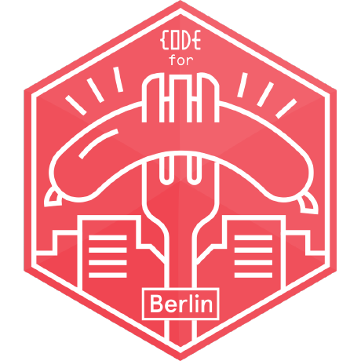
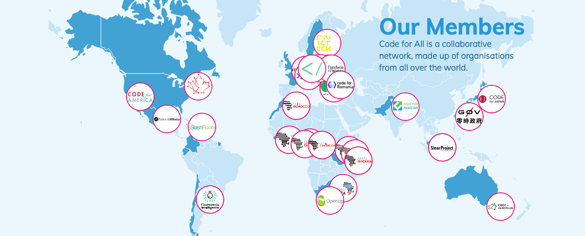

class: center, middle

.vspace[]

# Open Knowledge Lab Berlin

## Introduction

---

class: middle, center

## 👋 Welcome to the Berlin Open Knowledge Lab

.list[
* ⏰ we start around 19:15
* 🍹 drinks in the fridge in the back (free)
* 🚻 restrooms are at the end of any hallway
* 📶 guests@wmde 🗝 WMDE2324
]

---

## Open Knowledge Lab Berlin

.fig.open[]

.column.oklab[
In the OK Lab, we work on **digital tools**  utilizing Open Data from **public entities**, **community projects**, and **companies**.

We also **connect** the community with the local government and act as contact for the different stakeholders.

**Open Labs**, **Hack Nights**, and **full day events**, help us reaching out and educate on Open Data and Civic Tech.
]

---

## Open Knowledge Lab Berlin

.berlin-map[]

#### Open Lab

* every second Monday of the month
* 19:00-22:00
* Wikimedia, Tempelhofer Ufer 23/24

#### Hacknights

* every other Monday
* 19:00-22:00
* WikiBär, Köpenicker Straße 45
* near U Heinrich-Heine-Straße

---

background-image: url(img/berlin-map.png)

---

## Communication

.communication[]

[openknowledgegermany.slack.com](https://openknowledgegermany.slack.com) (ask me for an invite)

.communication[ ]

[github.com/codeforberlin](https://github.com/codeforberlin)  
[github.com/codeforberlin/tickets/issues](https://github.com/codeforberlin/tickets/issues)

---

background-image: url(img/germany-map.png)
background-size: cover

## Code for Germany

.ref[
    [codefor.de](https://codefor.de)
]

---

## Code for all

.fig.codeforall[]

.ref[
    [codeforall.org](https://codeforall.org)
]

---

## Thanks!

.fig.okf[
      
    [Open Knowledge Foundation](https://okfn.de)
]

.fig.wikimedia[
      
    [Wikimedia Deutschland](https://www.wikimedia.de)
]
